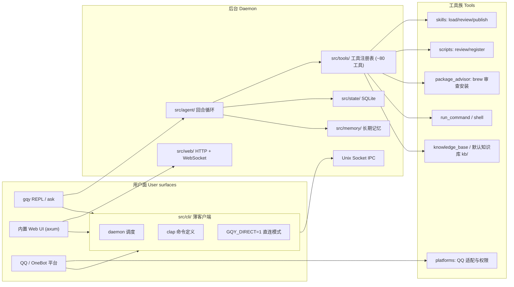

# GQY 架构概览

> 代码结构、模块职责与开发约定。面向想读代码或改代码的人。

## 架构图



## 顶层结构

```
src/
├── main.rs            # 入口：解析 CLI，分发到 cli/
├── cli/               # 命令行前端：REPL、one-shot、daemon、web 启动器
│   ├── live*.rs       # REPL 实时渲染（尾部跟随、编辑器、粘贴折叠）
│   ├── daemon.rs      # 命令调度（IPC 客户端）与 daemon 生命周期
│   ├── tests*.rs      # CLI 层测试（按主题分三段）
├── agent/             # 对话智能体：回合、溢出压缩、视觉、工具循环
├── llm/               # LLM 客户端：OpenAI 兼容（DeepSeek 等）
│   └── openai_compatible/  # 流式解析、提供商、工具累积器
├── config*.rs         # 配置读取与交互式 TUI
├── state/             # 会话/记忆状态存储（SQLite）
├── memory/            # 长期记忆、日记、好感度
├── platforms/         # 平台适配：QQ、终端、Web 事件模型、访问控制
├── web.rs, web/       # 内置 Web 服务（axum）
├── render/            # 终端渲染器
├── tools/             # 工具注册表与各工具实现
│   ├── skills.rs      # skill 加载/审查/发布（review_skill/publish_skill）
│   ├── scripts.rs     # 脚本注册/审查（review_script/register_script）
│   ├── skills/        # skill 草稿、安装、资源安全状态（resource_safety.rs）
│   ├── brew.rs        # Homebrew 官方包搜索/详情
│   ├── package_advisor.rs  # Homebrew 包审查与安装
│   ├── man.rs         # man 手册查询
│   └── applegamingwiki_query.rs
├── transfer/          # 数据单元/传输定义（export/import）
└── prompts/           # 人格与工作流提示词（brew-review 等）
```

## 关键设计

- **模块都保持 1500 行以内**：超长文件按 `mod 子模块` + `use 子模块::*` 拆分，
  impl 块可拆成多段（`impl X {}` 可以出现多次）。
- **人格与逻辑分离**：人格设定、工具使用规则在 `src/prompts/`；工具实现与
  审查流程在 `src/tools/`。
- **上下文即字节**：缓存友好是硬约束，详见 [理念.md](理念.md)。
- **资源安全门**：Skill 与脚本注册都要经过「AI 审查 → 用户确认 → 安装」三阶段，
  审查与安装分属不同轮次（`src/tools/mod.rs` 的 guard 强制）；审查状态落在
  `state/resource-review-state.json`（`src/skills/resource_safety.rs`）。

## 开发约定

1. 提交前跑 `cargo fmt --all --check`；CI 会强制。
2. 不要触碰 `kb/` 目录（用户手动维护）。
3. 发布走 CNB 流水线（`.cnb.yml`）：推送 `v*` 标签触发测试 → 双架构构建 →
   Release 上传（`cnbcool/attachments` 插件）→ Homebrew formula 回写。
   历史 GitHub Actions 见 `.github/workflows/release.yml`（归档）。
